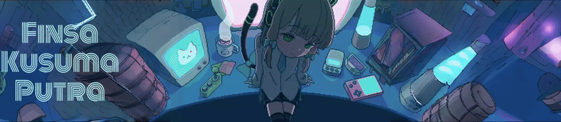

  
  
  
  
  
  
  
<b>Security Specialist | Arch Linux Enthusiast | CTF Player</b>

  
<i>"Understanding systems from the hardware up to the packets."</i>

---

### 🧠 Profile Overview
- 🎯 **Primary Goal:** Building a career in the Japanese tech industry.
- 🐧 **Daily Driver:** **Arch Linux** (Hyprland) for productivity & **Kali Linux** for offensive tasks.
- 🔄 **Transition:** Moving from Software Development (.NET/Android) to deep-dive **Cyber Security**.
- 🛡️ **Philosophy:** Breaking systems to understand how to build them better.

---

### 🚀 Technical Arsenal

| Category | Skills & Environments |
| :--- | :--- |
| **Operating Systems** |  |
| **Development** |  |
| **Infrastructure** |  |
| **Databases** |  |

---

### 🛠️ Offensive & Security Tools

  
  
  
   
  
  
  
   
  
  
  

---

### 🛡️ Cyber Security Focus
- **Network Penetration:** Service enumeration & vulnerability assessment using **Nmap**.
- **Brute Forcing:** Credential auditing via **Hydra** & offline password cracking with **John the Ripper**.
- **Web Exploitation:** Automated SQL Injection testing with **Sqlmap** and manual intercept analysis.
- **Traffic Analysis:** Deep packet inspection with **Wireshark** & **Tshark** to identify malicious patterns.

---

### 📊 GitHub Activity

  

   

---

### 📫 Secure Connection

  
  
  

 

  Decrypted with ❤️ on Arch Linux

